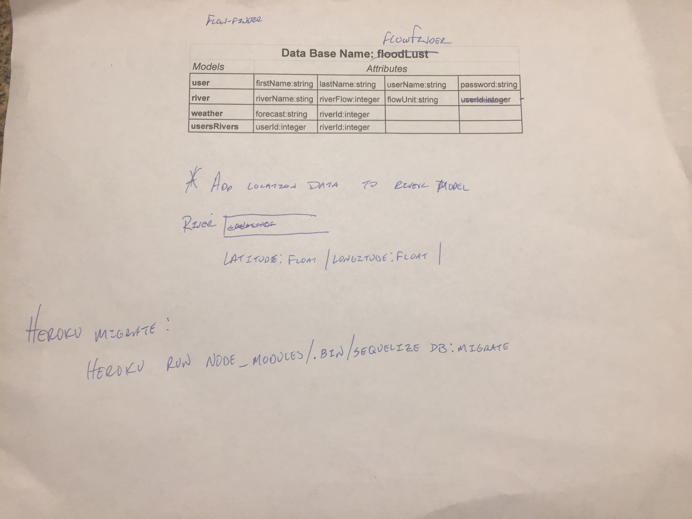

# Flow Finder
## GA WDI Project 2
## Start date: 10/1/17
A full stack node and express app to allow kayakers a quick look at a list of favorite rivers and flows.  The river flow data is obtained from the USGS API:
	**https://waterservices.usgs.gov/rest/IV-Test-Tool.html**

# Acknowledgments:
	* Daniel Patrinellis:  Thank you for allowing me to use your photos!  Check out his blog: 
		* http://fluidasalifestyle.blogspot.com/

	* My GA WDI Instructors: Steve Peters and Jackson Duhon - thank you for helping me untangle and re-write my code.
	* My GA WDI Classmates for reviewing and helping me troubleshoot my code.

# Lessons Learned:
	* If using boilerplate code, review the routes in the code prior to planning.  All the time spent planning routes had to be thrown out because the routes didn't make sense after incorporating the boilerplate code
	* Keep the end product requirements in front of me at all times; finally working on something I have a passion for caused me to daydream and add functionality above and beyond project 2 requirements.  Staying focused on the MVP as the first goal then adding more functionality after the MVP is completed will reduce confusion and stress. 

# Next Steps (after class)
	* Add weather API call for each river location to better forecast levels
	* Add more responsivness and styling more small screens
	* Add more rivers from other states
	* Add history to see if river levels are rising or falling
	* Update to call API from favorites page to ensure river levels are refreshing
	* Add surf wave tracking log

# Development Timeline:
## 10/1/17 -- 10/3/17 
	* Time spent planning and replanning routes, functionality, models, wire frames and deciding between webscraping or using an API for river level data.
		* Original idea was to make an app that would search both YouTube and Vimeo for whitewater kayaking videos at one time and display the search results on a single page.
		* This slowly changed to a more usable app to quickly allow a search of favorite river levels.

## 10/4/17
	* Decided to use USGS API to get river level data.  Spent the day setting up API and data calls.

## 10/5/17
	* Set up Auth from the boilerplate and re-tooled routes and models.  
	* Set up models:
		* River - stores users favorite rivers, levels, latitude, longitude, date of gauge reading.
		* User - stores users password, email and name.
		* riversUsers - many to many join table.
	* Initial routes writing:
		* GET call from API working
		* POST call to save favorite rivers to model working

## 10/6/17
	* Updated GET routes for many to many relationship working.
	* DELETE route to remove favorite rivers from favorites page proving to be a challenge.

## 10/7/17
	* Spent the entire day trying to get the DELETE route working.  Re-tooled variables and functions; still no luck in fixing the issue.
 
## 10/8/17
	* Still working on DELETE route.
	* Started styling

## 10/9/17
	* DELETE is still not working and driving me insane.

## Route planning

## Model planning

## Wireframes

